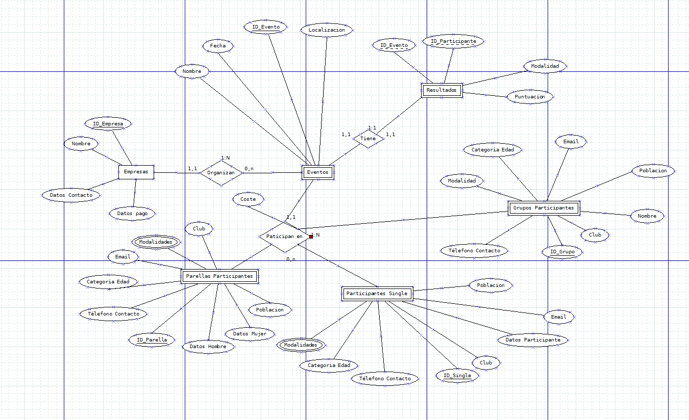

# FASE DE DESEÑO

- [FASE DE DESEÑO](#fase-de-deseño)
  - [1- Diagrama da arquitectura](#1--diagrama-da-arquitectura)
  - [2- Casos de uso](#2--casos-de-uso)
  - [3- Diagrama de Base de Datos](#3--diagrama-de-base-de-datos)
  - [4- Deseño de interface de usuarios](#4--deseño-de-interface-de-usuarios)

## 1- Diagrama da arquitectura

> *EXPLICACIÓN:* Incluír os diagramas de arquitectura que representen de forma gráfica a aplicación, os seus compoñentes e a súa interrelación: front-end, back-end, bases de datos, nube, microservizos, etc.

## 2- Casos de uso
Nun futuro substituirase o usuario administrador por un usuario de cada empresa organizadora.

## 3- Diagrama de Base de Datos

> No meu caso utilizarei 3 bases de datos (Eventos, Usuarios, Ranking)
>
> - Modelo Entidade/relación
>   - Eventos:
>   
>   - Usuarios:
>   
> - Modelo relacional
>
> Pódese entregar a captura do phpMyAdmin se se emprega MariaDB como Modelo relacional.

## 4- Deseño de interface de usuarios
 Neste caso centreime nos mockups da version movil xa que  actualmente a maioria de usuarios chegan dende movil, ademais a unica diferenza coa version de escritorio son as proporcións. 

[Enlace a mockups](https://miro.com/welcomeonboard/SHpQUDJ5MzFOVVF1SDIwMEVFN0dYWGpPb3VxNmd4TTd3WVlvbWNnOVU4Nm9mSDVMalJ3WGhDNlJxWEo2d1p1d3wzNDU4NzY0NTM0OTQ1NzU4OTQ0fDI=?share_link_id=943342740128)