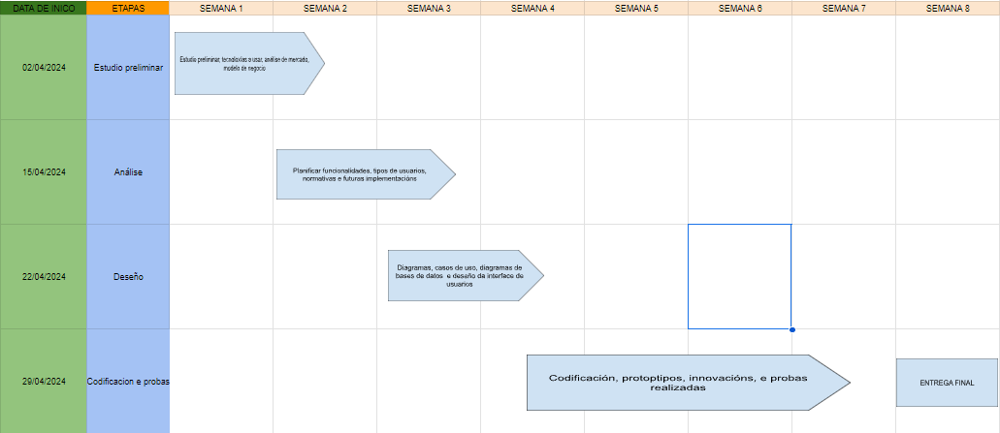

# Anteproxecto fin de ciclo

- [Anteproxecto fin de ciclo](#anteproxecto-fin-de-ciclo)
  - [1- Descrición do proxecto](#1--descrición-do-proxecto)
  - [2- Xustificación do proxecto](#2--xustificación-do-proxecto)
  - [3- Axudas e financiación](#3--axudas-e-financiación)
  - [4- Prevención de riesgos laborales](#4--prevención-de-riesgos-laborales)
  - [5- Modelo de negocio](#5--modelo-de-negocio)
    - [5.1- Viabilidade](#51--viabilidade)
      - [5.1.1- Viabilidade técnica](#511--viabilidade-técnica)
      - [5.1.2- Viabilidade económica](#512--viabilidade-económica)
    - [5.2- Competencia](#52--competencia)
    - [5.3- Promoción](#53--promoción)
  - [6- Requirimentos](#6--requirimentos)
  - [7- Planificación](#7--planificación)

## 1- Descrición do proxecto

> DanceSync non é unha simple plataforma web; é unha comunidade de baile deportivo.
>
> DanceSync nace coa idea de eliminar as barreiras que dificultan o acceso ás competicións, simplificando a inscrición nos diferentes eventos que se organizan. Ademais, imos un paso máis alá, ofrecémoslles aos organizadores ferramentas para anunciar os seus eventos e xestionar todas as tarefas administrativas de forma rápida e eficiente.
>
> En DanceSync, intentamos mellorar o benestar dos deportistas da nosa comunidade. Cremos que a danza deportiva non é un simple deporte físico senón que é unha forma de vida. Por este motivo, esforzámonos por mellorar a calidade de vida dos bailaríns de todos os xeitos posibles.
>
> Qué nos fai diferentes? Non só somos unha plataforma de inscrición; Somos un ecosistema completo que abarca desde o envío de resultados de concursos ata un calendario de eventos e un portal de emprego temporal. A nosa galería de fotos e vídeos recolle os momentos máis emocionantes e memorables das competicións, mentres que as nosas clasificacións e puntuacións actualizadas manteñen a todos informados.
>
> Aínda que comezamos centrados no baile deportivo, non queremos limitarnos só a ese ámbito. No futuro poderiamos ampliar e adaptarnos ás necesidades de calquera asociación ou entidade que busque servizos similares. Incluso pensamos nunha posible internacionalización.
>
> #### Técnoloxias que se utilizarán:
>
> **Lenguajes de Programación y Tecnologías Web:**
>
> - HTML
> - CSS
> - JavaScript
> - PHP
>
> **Diseño y Prototipado:**
>
> - Figma
>
> **Base de Datos:**
>
> - MariaDB
>
> **Servidor de Alojamiento:**
>
> - IONOS
>
> **Método de Pago:**
>
> - Stripe
>
> **Librerías:**
>
> - Swiper
> - LightGallery

## 2- Xustificación do proxecto

> DanceSync nace polas miñas propias necesidades e as dos meus compañeiros de club, como deportista federado nesta modalidade de baile deportivo, e tendo os coñecementos necesarios para mellorar o situación xeral da comunidade.
>
> Ocurriuseme crear a miña propia plataforma, xa que á paxina da que dispoñemos ahora mesmo está bastante atrasada en canto a servizos dispoñibles e unha falta bastante grande de outros tantos, por exemplo que non exista a posibilidade de pago telemático, e se deba de facer mediante transferencia bancaria.

## 3- Axudas e financiación

> ##### Financiacion incial:
>
> Gastos iniciales únicos:
>
> - Equipo de traballo: 950€ (Ordenador e periféricos)
> - Licencias de software: 150€
>
> Gastos mensuales:
>
> - Internet: 45€/mes
> - Servidor de alojamiento e dominio: 20€/mes
> - Electricidad: 42€/mes
>
>   **Coste total primer año**: 2384€
>
> ##### Axudas:
>
> Dende o ministerio de Traballo do Goberno de España ofrecen un programa de promoción do empleo autónomo, na que as difrentes comunidades ofrecen ata 9.000 euros de financiamento para os novos emprendedores.

## 4- Prevención de riesgos laborales

> #### Identificación de riscos:
>
> 1. **Riscos ergonómicos**:
>    - Posturas inadecuadas.
>    - Fatiga visual.
>    - Estrés musculoesquelético.
> 2. **Riscos psicosociais**
>    - Estrés laboral
>    - Dificultade para desconectar.
> 3. **Riscos adicionais**:
>    - Accidentes domésticos
>    - Ciberseguridade.
>
> #### Medidas cautelares
>
> 1. **Riscos ergonómicos**:
>    - Establecer un espazo de traballo ergonómico.
>    - Coidar a postura.
>    - Controlar o tempo de exposición ás pantallas.
> 2. **Riscos psicosociais**:
>    - Establece una rutina de trabajo.
>    - Tomar descansos regulares.
>    - Establecer límites claros entre a vida laboral ea personal.

## 5- Modelo de negocio

> DanceSync entraría no modelo de negocio SaaS (Software as a service)
>
> **Xustifica a elección.**
>
> 1. Xustificación das necesidades detectadas que cubre o sistema a desenvolver.
>
> - Como explicaba anteriormente, como deportista do sector vexo necesaria una plataforma de inscripción máis moderna, e que realmente axude aos usuarios e non só sirva para inscribirse senon que teña outros usos.
>
> 2. Posibilidades de comercialización do sistema (viabilidade, competidores, ...).
>
> - **Comercialización**:
>   - O mercado do baile deportivo e grande e está en constante crecimiento independientemente da modalidad na que se participe, pero polo contrario non existe case ningunha plataforma que ofrezca todos os servizos que DanceSync aporta.
> - **Competidores**:
>   - Existe un número moi baixo de competidores en canto a plataformas de baile deportivo, por exemplo, solo en Galicia existe unha unica pltaforma de inscripción, á que ademais é bastante limitada.
>
> 3. Ideas para a súa comercialización.
>
>    - **Empresas e organizacións do sector**:
>      - Ofrecer os servizos ás federacions nacionais e autonómicas ou organizadores de eventos de baile, e establecer DanceSync como portal de inscripción por defecto nos eventos que se desenvolvan baixo a empresa que organice. Por exemplo, a federacion galega non leva nin 1 ano dende a súa creación e pode ser un obxetivo claro para DanceSync.
>
> - **Servizos da plataforma**:
>   - En canto a os costes de inscripción serán establecidos polos organizadores pero DanceSync recibira unha pequena comisión, ademais nas categorias de grupos poderíanse establecer descontos para incentivar aos participantes.
>   - Na parte da inciativa ReDance (Reventa de vesturio de segudna man), que estará dispoñible nun futuro, a plataforma tamén levaría unha comisión por venta.

### 5.1- Viabilidade

#### 5.1.1- Viabilidade técnica

> Os recursos tanto físcos como de software para o desarrollo dunha aplicación web non son excesivamente costosos. Tendo unha boa planificacion e presuposto axeitado, ademais como eu mesmo levarei todo o proceso eso reduce o seu coste en gran parte.
>
> - Existe algún impedimento técnico que dificulte o proceso produtivo?
>  Non, xa que como explico antes, eu mesmo desenvolverei a web.

#### 5.1.2- Viabilidade económica

> - Os beneficios do proxecto son superiores aos costes?
>
>   - Como os costes se reducen considerablemente ao ser unha unica persona desenvolvendo o proxecto. Creo que DanceSync e un proxecto totalmente viable, grazas a publicidade e os outros métodos de ingresos da web.
>
> - As perdas poden cubrirse vía financiamento (por parte da administración pública, con subvencións, etc)?
>   - En caso de que houbera perdidas, existen varios metodos como as diversas subvencións que existen.

### 5.2- Competencia

- A nivel de nacional non existe ningunha web que rivalize con todos os servizos que aporta DanceSync xa que sendo escasas, ningunha delas combina os servizos que ofrecemos.
- Podense considerar competencia ás empresas que desenvolven páxinas web persnalizadas, pero non tería o nivel de coñecementos nin de implicacion que ten DanceSync xa que a plataforma non so está creada como un producto, se non que esta creada dende a perspectiva dun usuario.

### 5.3- Promoción

> A promoción de DanceSync faráse mediante redes sociais e posicionamento web na súa maioria ainda que ao levar os procesos de inscripcion dos eventos deportivos entre outros, indirectamente tamén se está publicitando a plataforma.
>
> Estás técnicas foron elexidas pensando na importancia das redes sociais e internet en esta época na que vivimos e que forman parte da nosa vida cotiá.

## 6- Requirimentos

> - **Infraestructura:** IONOS ofrece toda a infraestructura necesearia como, dominio web, servidor web dedicado e almacenamiento na nube, tamén ofrece unha base de datos MariaDB.
> 
> - **Backend:** 
>   - **Linguaxes de programación**: PHP será a linguaxe principal en canto a backend, para xestionar os usuarios etc.
>   - **Bases de datos**: Como se mencionou anteriormente usarase unha base de datos MariaDB proporcionada por IONOS.
> - **Frontend:**
>   - **Linguaxes de programación**: HTML, CSS y JavaScript son as linguaxes de programación básicos para o desarrollo da interfaz web.
>   - **Librerías:**
>     - Swiper: Para crear sliders ou carruseles de imáxes.
>     - LightGallery: Para crear galerías de imáxes con funcions avanzadas como zoom e lightbox.
>     - Librería de AJAX: Para realizar solicitudes HTTP asíncronas e mellorar a experiencia do usuario.
>   - **Deseño:**
>     - Figma utilizarase para diseñar a interfaz de usuario da plataforma, creando prototipos interactivos que faciliten o desarrollo da mesma.
>   - **Método de pago:**
>     - Stripe: Utilizarase Stripe como plataforma de pago para procesar os pagos das inscripcións a eventos. Stripe ofrece unha API fácil de usar e unha amplia gama de funcións para gestionar pagos de forma segura.
>   - **APIs**:
>     - APIs de mapas: Utilizaranse APIs de mapas como Google Maps ou OpenStreetMap para mostrar a ubicación dos eventos na plataforma.
>     - APIs de redes sociais: Utilizaranse APIs de redes sociais como Facebook ou Twitter para permitir aos usuarios compartir eventos e conectar con outros usuarios da plataforma.

## 7- Planificación
>
> O proxecto estará formado polas seguintes fases:
>
> - Estudo preliminar (2 de abril - 15 de abril)
> - Análise ( 15 de abril - 22 de abril)
> - Deseño ( 22 de abril - 29 de abril)
> - Codificación e probas (29 de abril - 27 de maio).

